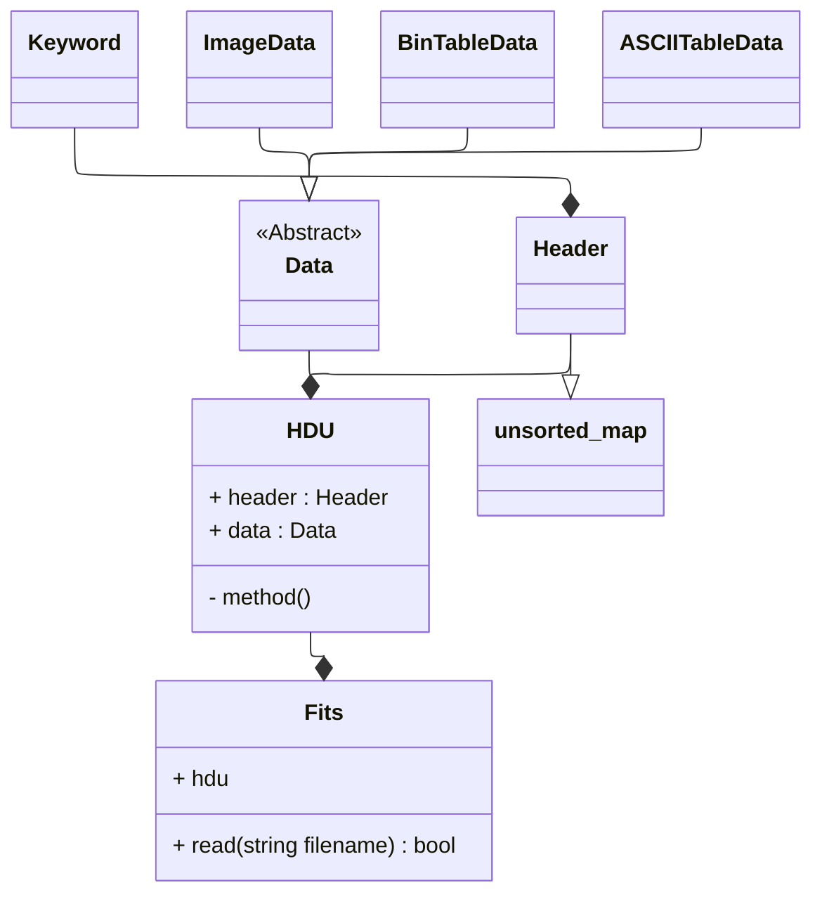

```mermaid
---
config:
  layout: elk
  elk:
    mergeEdges: true
    nodePlacementStrategy: LINEAR_SEGMENTS

---
classDiagram
class Fits {
    + hdu
    + read(string filename) bool
}
class HDU {
    + header : Header
    + data : Data
    - method()
}


class Data
<<Abstract>> Data
class Header
HDU --* Fits
Header --* HDU
Data --* HDU
Keyword --* Header
ImageData --|> Data
BinTableData --|> Data
ASCIITableData --|> Data
Header --|> unsorted_map
```
